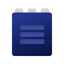
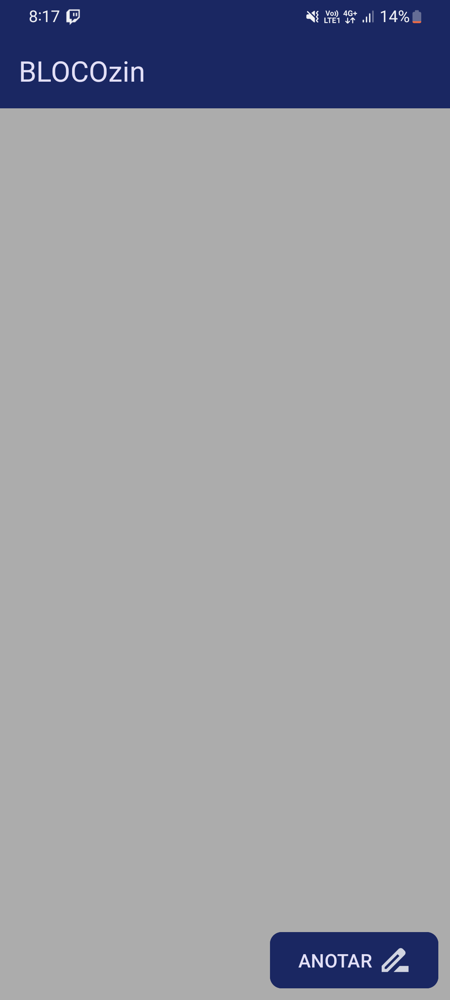
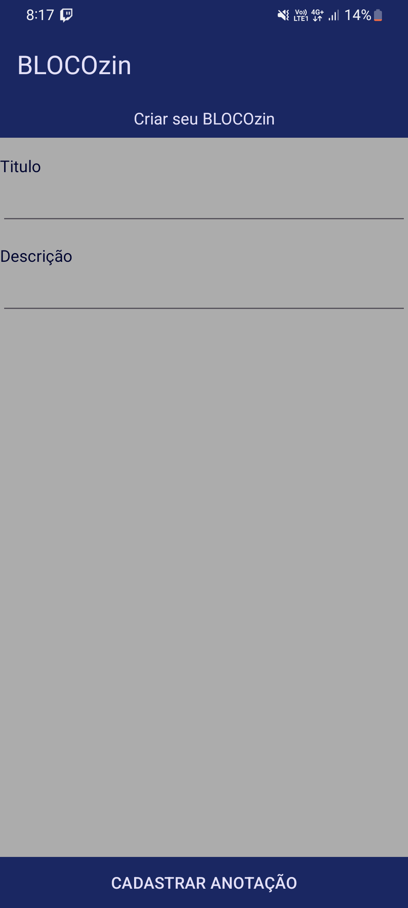
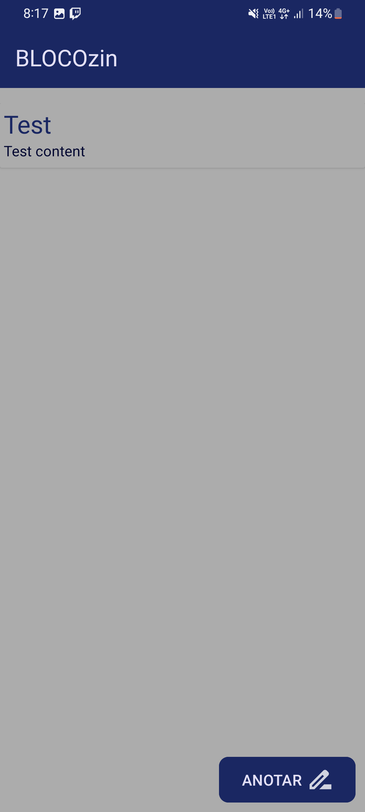
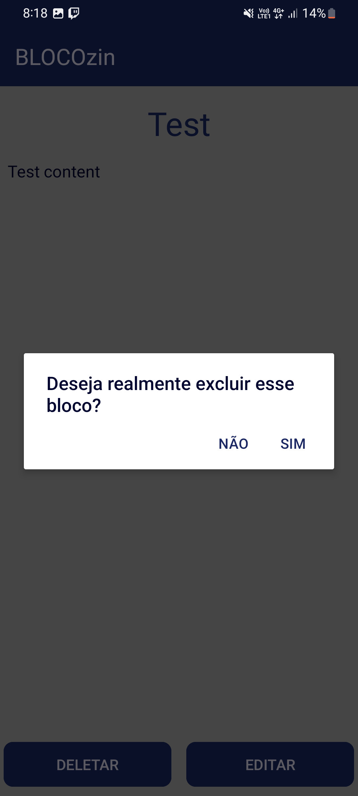
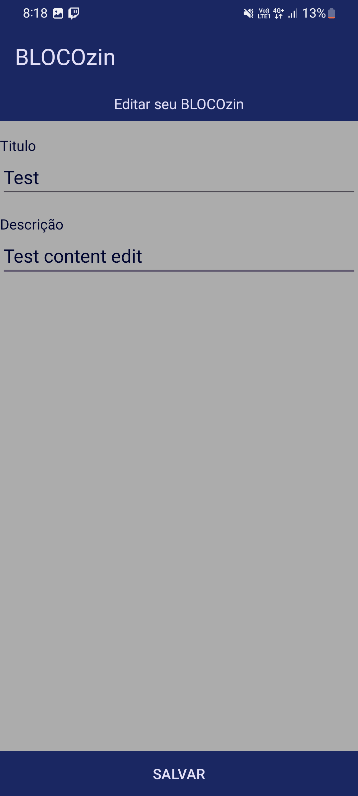
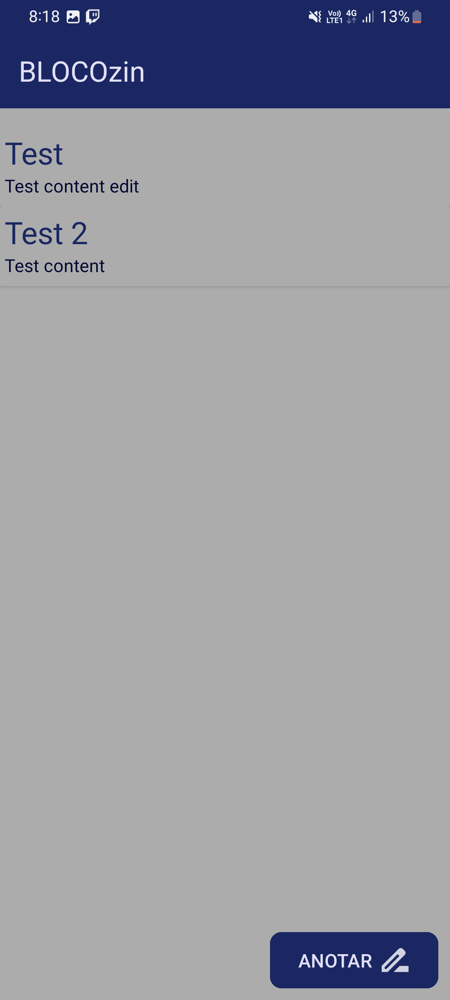

# BLOCOzin - MOBILE

Este projeto é uma entrega de um trabalho requerido na faculdade de TADS e também uma extensão de outro projeto que eu mesmo realizei que nada mais é a versão web deste aplicativo.
Este aplicativo propõe uma solução de bloco de notas onde o usuário possa anotar blocos, editar ou ler os mesmo, os blocos anotados ficam salvos no próprio dispositivo, cabendo assim em futuras atualizações o mantimento do backup dos blocos em nuvem com o FireBase da Google. Foi desenvolvido com o Android Studio utilizando-se de Java como linguagem procipal.

## Funcionalidades

- Temas dark e light
- Preview em tempo real
- Gerenciamentos de blocos de notas

## Stack utilizada

**IDE:** Android Studio

**Linguagem:** Java

## Licença

[MIT](https://choosealicense.com/licenses/mit/)

## Screenshots

- Tela inicial

- Tela de anotar novo bloco

- Tela inicial com um bloco

- Modal de confirmação de deleção do bloco

- Tela de editar uma bloco

- Tela de vizualição de um bloco

- Tela inicial com mais de um bloco

